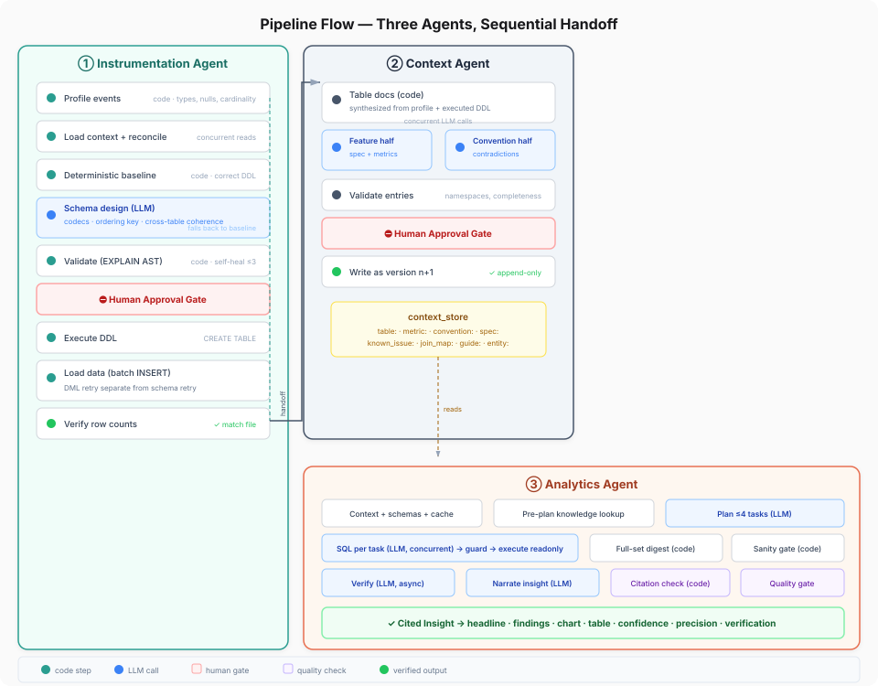

# Clickwright — Architecture

## Overview

Clickwright is an agentic analytics pipeline for Atlys. A PM uploads a feature spec; three agents — Instrumentation, Context, and Analytics — collaborate through a shared ClickHouse-backed knowledge store to produce live tables, documented context, and cited insights. Every decision is traced in Langfuse.

## System Architecture

The three agents never call each other directly. All shared state flows through `context_store` in ClickHouse — this makes each agent independently testable and the pipeline recoverable after any failure.

**Agent handoff:** Instrumentation → Context is a direct function call (the context agent receives the instrumentation result as input). Analytics reads from `context_store` independently — it has no dependency on when instrumentation ran.

## Pipeline Detail

### ① Instrumentation Agent

Transforms a feature spec into live, optimized ClickHouse tables.

| Step | Type | What it does |
|------|------|-------------|
| Profile | Code | Per-event field types, null rates, cardinality, numeric ranges |
| Context + reconcile | Code (concurrent) | Load conventions + check live schema matches docs |
| Baseline schema | Code | Correct-but-plain DDL from measurements (the fallback) |
| Schema design | LLM (1 call) | Optimizes ALL tables together — codecs, ordering keys, type coherence |
| Validate | Code | Every profiled column present, none invented, EXPLAIN AST passes |
| **Approval gate** | Human | Approve or reject with feedback → regenerate |
| Execute + load | Code | CREATE TABLE → batch INSERT (5K/batch) with DML-specific retry |
| Verify | Code | Row count in table must match source file |

### ② Context Agent

Maintains the shared knowledge store that all agents read from.

| Step | Type | What it does |
|------|------|-------------|
| Table docs | Code | Synthesized from measured profile + executed DDL — no LLM needed |
| Feature half | LLM | `spec:` summary + `metric:`/`funnel:` definitions the PM's questions need |
| Convention half | LLM (concurrent, conditional) | Revisions to existing conventions + contradiction warnings — skipped when no deviations |
| Validate | Code | Namespaces, one entry per created table, size checks |
| **Approval gate** | Human | Approve proposed entries |
| Write | Code | Append as version n+1 — code owns versions, run_ids, timestamps |

### ③ Analytics Agent

Turns a PM's question into a cited, verified insight.

| Step | Type | What it does |
|------|------|-------------|
| Context load | Code (concurrent) | Knowledge bundle + schemas + cache check |
| Pre-plan lookup | Code | Surface relevant known issues + metrics before planning |
| Plan | LLM | ≤4 aggregate tasks with proactive segmentation |
| SQL per task | LLM (concurrent) | Write → guard (readonly=1) → execute → retry ≤3 |
| Result digest | Code | Full-set stats computed in ClickHouse (exact rates, not extrapolation) |
| Sanity gate | Code | Drop empties, flag >100% rates, low-n warnings |
| Verify | LLM (async) | Independent query cross-checks the headline figure |
| Knowledge lookup | LLM | Known issues that explain anomalies |
| Precision | Code | Wilson intervals on every rate |
| Narrate | LLM | Headline + findings + chart + segment table |
| Citation check | Code | Every number must trace to SQL results |
| Quality gate | Code/LLM | Deterministic when code checks pass; LLM only for edge cases |

## Context Store Schema

The knowledge store is an append-only, versioned ClickHouse table. Reads resolve the latest version per entity via `ORDER BY entity ASC, version DESC LIMIT 1 BY entity`.

| Namespace | What it stores |
|-----------|---------------|
| `overview:` | Business context |
| `convention:` | Rules every query must follow (hygiene filters, os bucketing, currency) |
| `join_map:` | How tables join (user_id, application_id paths) |
| `guide:` | Funnel analysis methodology |
| `table:` | Per-table docs: columns, join keys, gotchas |
| `metric:` | Metric definitions with exact numerator/denominator |
| `funnel:` | Funnel stage definitions |
| `spec:` | Feature summaries from instrumented specs |
| `known_issue:` | Data quirks (K1–K7) |

## Quality & Correctness Stack

Every insight passes through multiple deterministic checks before reaching the PM:

1. **SQL guard** — readonly=1, banned-keyword filter, single-statement, LIMIT cap
2. **Result digest** — full-population stats computed in ClickHouse, not extrapolated from samples
3. **Sanity gate** — empty results dropped, rates >100% flagged, n<50 warned
4. **Citation check** — every number in prose must exist in SQL results (or be a verified arithmetic of two that do)
5. **Wilson precision** — 95% confidence intervals on every rate, from the actual denominator
6. **Execution-backed verification** — an independently written query cross-checks the headline figure
7. **Established figures** — follow-up answers carry prior figures + denominators to prevent contradiction

## Tracing (Langfuse)

Every pipeline run and chat answer is a Langfuse trace with numeric scores:

| Score | What it measures |
|-------|-----------------|
| `self_heal_attempts` | How many DDL/SQL retries before success |
| `rows_verified` | 1 if all row counts matched |
| `context_entries_written` | How many knowledge entries were added |
| `sanity_flags` | Number of flagged results |
| `citation_failures` | How many narration retries for uncited numbers |
| `cache_hit` | 1 if served from insight_cache |

## LLM Provider

**Model:** Claude Sonnet 5 (configurable via `CLICKWRIGHT_MODEL`)

**Why Claude:** Structured JSON output with strict schema adherence, strong ClickHouse SQL generation, and reliable multi-section prompt following. Effort pinned to `medium` — prompts are tightly specified and schema-validated.

**Auth:** `ANTHROPIC_API_KEY` (direct API) or Claude Code OAuth login (company plan).

## Tech Stack

| Component | Technology | Why |
|---|---|---|
| Database | ClickHouse Cloud | Competition platform; ideal for event analytics at scale |
| Backend | Node.js + TypeScript | Async-native, strong typing, fast iteration |
| LLM | Claude (Anthropic) | Best structured-output reliability for SQL + JSON |
| Tracing | Langfuse Cloud | Full observability; every span, generation, and score queryable |
| Frontend | React + Vite + Tailwind | Component library with SSE streaming support |
| Validation | Zod | Runtime schema validation on every LLM output |
