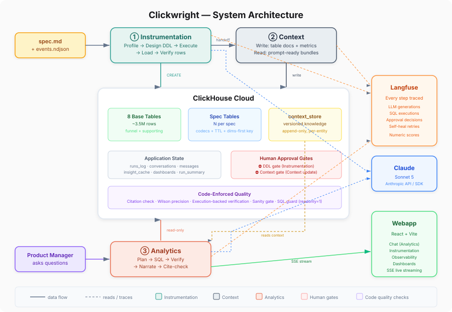

**Clickwright** — The fastest path from spec to insights.
Three AI agents turn a feature spec into live ClickHouse tables, documented context, and PM-ready insights — with every decision traced in Langfuse and human-approved.

## Collaborators

- Biswaranjan Padhy ([@bjpadhy](https://github.com/bjpadhy))
- Wilson Patro ([@wilsonpatro](https://github.com/wilsonpatro))
- Harshit Singh ([@harshitsingh](https://github.com/harshitsingh))

## What it does

A PM uploads a feature spec (`spec.md` + `events.ndjson`). Clickwright:

1. **Profiles** every event field — types, null rates, cardinality, ranges
2. **Designs** optimized ClickHouse schemas — codecs, ordering keys, Decimal64 for money, TTL
3. **Executes** DDL, loads data, verifies row counts — with human approval before any irreversible change
4. **Documents** everything in a versioned knowledge store — metrics, conventions, gotchas, contradictions
5. **Answers** PM questions with cited, verified insights — every number traces to a SQL result, bounded by Wilson intervals, cross-checked by an independent query

All three agents share state through `context_store` in ClickHouse. Every step is a Langfuse span.

## Live Demo
https://shard-spartans.best/

## Demo Video
https://youtu.be/XWTTp4yjbnI

## Architecture



Three agents, one shared brain — the `context_store` in ClickHouse:

| Agent | What it does | Key properties |
|---|---|---|
| **Instrumentation** | spec → profiled, optimized, live tables | Deterministic baseline + LLM optimization; human approval gate; DML retry separate from schema retry |
| **Context** | tables → versioned knowledge store | Append-only; table docs synthesized from measurements; LLM writes spec summaries + metrics; detects contradictions |
| **Analytics** | PM question → cited insight | Plan → concurrent SQL → full-set digest → verify → narrate → citation check; every number provably from ClickHouse |

**Agents never call each other.** All shared state flows through `context_store`. Runs are serialized; tasks within a run are concurrent.

**Langfuse is deeply integrated**. The `step()` function in `core/tracing.ts` wraps every operation, creating a Langfuse span with input/output, timing, and numeric scores. Every LLM generation, SQL execution, and approval decision is captured. [Full architecture →](ARCHITECTURE.md)

### Correctness stack (7 layers between the LLM and the PM)
1. **SQL guard** — readonly=1, banned keywords, single statement, LIMIT cap
2. **Full-set digest** — population stats computed in ClickHouse, not extrapolated from samples
3. **Sanity gate** — empty results dropped, rates >100% flagged, n<50 warned
4. **Citation check** — every number must exist in SQL results or be a verified delta
5. **Wilson precision** — 95% confidence intervals from actual denominators
6. **Execution-backed verification** — independent query cross-checks the headline figure
7. **Established figures** — follow-ups carry prior figures to prevent silent contradiction

## How we built it
| Component | Technology | Why |
|---|---|---|
| Database | **ClickHouse Cloud** | Event tables, knowledge store, run history, insight cache — all in one engine with codecs, TTL, and optimized ordering keys |
| LLM | **Gemini 3.1 Flash Lite** (default) or **Claude Sonnet 5** | Swappable per-deployment via `LLM_PROVIDER`; Gemini for speed on a free key, Claude for structured-output reliability. Zod-validated every call either way |
| Tracing | **Langfuse Cloud** | Every span, generation, and score queryable; numeric scores as sortable columns |
| Backend | **Node.js + TypeScript** | Async-native for concurrent task execution; strong typing with Zod runtime validation |
| Frontend | **React + Vite + Tailwind** | SSE streaming for live pipeline steps; chat UI with insight cards, charts, confidence badges |
| Validation | **Zod** | Every LLM response parsed through strict schema; malformed output triggers self-healing retry |

### Key implementation details
- **ClickHouse best-practice DDL generation** — schemas are not guessed. Code profiles every field (types, null rates, cardinality, numeric ranges) and synthesizes a deterministic baseline DDL with correct `LowCardinality`, `Decimal64` for money, and sensible ordering keys. The LLM then optimizes codecs, partitioning, cross-table type coherence, and TTL in a single call — guided by the ClickHouse architecture review skill. If the LLM fails, the measured baseline ships unchanged. Every DDL is dry-run through `EXPLAIN AST` before execution.
- **Cross-conversation context** — follow-up answers carry prior SQL, established figures (with their denominators and source tables), and dropped-task reasons from earlier turns. This prevents silent denominator drift: if one answer reports UAE conversion as 56.6%, the next turn knows both the number and the `n` it rests on, so a changed denominator is explained rather than silently contradicting what the PM was already told. History window is 12 turns with smart compression.
- **Wilson score validation** — every rate the Analytics Agent reports is classified (proportion, mean, quantile, ratio) and only proportions get a 95% Wilson confidence interval computed from the actual denominator. The interval is reported inline with the figure, not separately. Confidence (high/medium/low) is *computed* from the **headline** figure's interval, sanity flags, citation retries, and whether an independent verification query reproduced the headline — never asked of the model. The headline is the verified column if there was one, else the whole-population rate, else the best-supported bounded figure; a thin tail segment cannot set it, which is what stopped one n=2 row from calling a reproduced n=14,026 answer "low". Other thin segments still cost the answer, just by a bounded amount. A ±10pp+ headline interval drops confidence to low; a verification disagreement does the same.
- **Concurrent SQL execution** — ≤4 tasks run in parallel; dependent tasks (funnels) run sequentially with result forwarding.
- **Full-set profiling** — large results are wrapped as subqueries and profiled entirely in ClickHouse. The narrator sees exact population stats, not sample extrapolations.
- **DML vs schema retry** — transient INSERT failures retry the load only; type-mismatch errors trigger schema redesign.

### Project structure
```
backend/        Typescript pipeline + HTTP/SSE server
webapp/         React + Vite frontend
specs/          6 sample feature specs (spec.md + events.ndjson)
docs/           SVG architecture diagrams + the confidence walkthrough
submission/     pitch script and demo fixtures
ARCHITECTURE.md, RUN.md   at the repo root
base_context.md Human-authored seed for the knowledge store
```

## How to run it

See **[RUN.md](RUN.md)** for full setup instructions.

**Quick start:**
```bash
cd backend
cp .env.example .env           # fill in ClickHouse, Langfuse, and a model key (Gemini or Anthropic)
npm run seed                   # one-time: seed context_store from base_context.md
docker compose up -d --build   # http://localhost:8787
```

**Environment variables:**

| Variable | Required | Description |
|---|---|---|
| `CLICKHOUSE_URL` | Yes | ClickHouse Cloud HTTPS endpoint |
| `CLICKHOUSE_PASSWORD` | Yes | ClickHouse password |
| `LANGFUSE_PUBLIC_KEY` | Yes | Langfuse project public key |
| `LANGFUSE_SECRET_KEY` | Yes | Langfuse project secret key |
| `GEMINI_API_KEY` | Yes* | Google AI Studio key (free, no card) — selects the Gemini backend |
| `GEMINI_MODEL` | No | Default `gemini-3.1-flash-lite`. The newest Gemini models can have very low free-tier daily caps (20/day on `gemini-3.8-flash`, enough for one question), so this may need changing |
| `ANTHROPIC_API_KEY` | Yes* | Anthropic API key (*one model credential is required: Gemini, this, or Claude Code OAuth) |
| `LLM_PROVIDER` | No | Force a backend: `gemini` \| `anthropic` \| `anthropic-oauth` |

## Confidence

Every answer carries a score from 0.05 to 1.00 and a band — high at 0.75 and above,
medium from 0.45, low below that — computed in code and never asked of the model. It
starts at 1.00; three ceilings can cap it (a failed verification at 0.44, nothing
verified at 0.70, nothing bounded at 0.60) and each weakness in the evidence subtracts a
named amount. The deltas sum exactly to the score, so the card reads as a receipt.

[docs/CONFIDENCE_WALKTHROUGH.md](docs/CONFIDENCE_WALKTHROUGH.md) walks four real
questions asked in one conversation against the live service, with every signal as the
run produced it. Between the third and the second, only the asker's specificity
changes, and it is worth 0.16.
